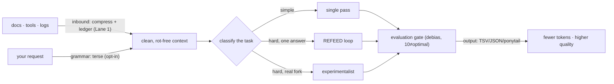

<div align="center">
  
</div>

<p align="center">
  <a href="LICENSE"></a>
  
  
  
</p>

<p align="center"><b>mention it once → auto-applied lossless compaction + the tools Claude lacks · honest-first — every claim measured, the nulls named</b></p>

<p align="center">
  <a href="#three-ways-to-install">Install (3 tiers)</a> ·
  <a href="#what-is-ordo">What</a> ·
  <a href="#it-runs-itself-auto-activation">Auto-activation</a> ·
  <a href="#architecture--the-stack">Architecture</a> ·
  <a href="#the-numbers">Numbers</a> ·
  <a href="#honesty-the-moat">Honesty</a>
</p>

---

## Three ways to install

| | **🟢 ordo.md** | **⚫ ORDO Lean** | **🔶 ORDO Full** |
|---|---|---|---|
| **One line** | the discipline as a paste-in | token saving, nothing else | the whole layer that fixes the annoyances |
| **Install** | paste [`OPERATING-PROFILE.md`](OPERATING-PROFILE.md) (or [`CONTEXT-SAVER.md`](CONTEXT-SAVER.md) for lean prose) into `CLAUDE.md` | `npx ordo init --lean` | `npx ordo init` (or `/plugin install`) |
| **You get** | compression + the dispatcher as prose | format-by-shape + ponytail + inbound compaction, **measured −47–68%** | Lean **+** the classify→route dispatcher + the `/ordo` command + the gates (opt-in) + a **[last30days](https://github.com/mvanhorn/last30days-skill) social research (free tier) + web crawler + native PDF + video sight (ffmpeg→vision), all compaction-wrapped (−24–62%)** + `.ordo/` persistence that grows with the project |
| **For** | "just put it in my prompt" | "I just want lower bills" | "the one install for all of it" |
| **Footprint** | ~1k tokens, zero deps | tiny skill, zero MCP | a plugin + `/ordo` + the last30days skill (free tier) + `.ordo/mcp.json.example` |
| **Proven** | compression (measured) | compression (measured) | compression + tool-compaction (both measured); the gates honest/opt-in |

```bash
npx ordo init          # Full — auto-router + gates + bundled tools + persistence
npx ordo init --lean   # Lean — token saving only, as neat and light as caveman
```

**Lean is exactly that:** *only* the compacting + verbosity. No gates, no tools, no quality claims — the smallest
thing that pays for itself. **Full is the superset:** **[last30days](https://github.com/mvanhorn/last30days-skill)**
social/recent research across Reddit/X/YouTube/TikTok/IG/HN/GitHub (free tier, scored by upvotes/likes/real-money) +
a web **crawler** (firecrawl) + Claude Code's **native PDF** + **video sight** (ffmpeg keyframes → native image
vision — `tools/video_frames.py`, no fake MCP), and it **compacts every tool's output** (the measured
differentiator), and it grows with the project. Per-tier breakdown: [`docs/V2-ARCHITECTURE.md`](docs/V2-ARCHITECTURE.md) · [`docs/tiers/`](docs/tiers/).

## It runs itself (auto-activation)

The reason frameworks don't get used: you have to remember to invoke them. ORDO doesn't make you.

1. **Set it once** — `npx ordo init`, `/plugin install`, drag the skill into `.claude/skills/`, or a line in
   `CLAUDE.md`. That one step is the whole setup; after it, the skill is resident every session, a bare "use ORDO"
   (or nothing) is enough — it auto-fires on coding/agentic tasks — and **`/ordo`** activates it on demand.
2. **It routes itself** — `classifyTask()` decides *which part* applies per task (light → just compress + answer;
   hard → arm the ledger + the right gate). You never pick.
3. **It persists and grows** — Full drops a project-local `.ordo/ledger.md` + `lessons.md` the skill reads at the
   start of a hard task and appends to as it works. That is "grows with the project" — concrete, a human-run
   evidence loop (not autonomous self-growth; we measured that null and named it).

No memorization, no manual invocation, no drift back to raw Claude. As light to live with as caveman.

## What is ORDO

ORDO is the **auto-applied agent layer** you give your LLM. It does **not remodel how Claude thinks** — a frontier
model already reasons well in a single pass. It **fills the gaps of raw Opus with no setup**: a strong `CLAUDE.md`,
compaction, the goal held at the front, context + long-form management, read-files-once discipline. Set it once and
it does three *proven* things: **compresses** in and out so you pay for fewer tokens (measured **−47–68%**),
**bundles the tools Claude lacks** (crawler + social + native PDF + video sight) and **compacts their output**, and
**holds a long session together** — goal-lock + a ledger + rot-compaction so the work doesn't drift or rot past
~50K. The gains are in **context and long-form** (grounded in the rot literature); it does *not* claim a
hallucination or IQ boost (those wash on a strong model — honestly named). It ships as a **paste-in spec**
(load it into your system prompt / `CLAUDE.md`)
plus a thin **npm runtime** for the deterministic bits.

Under all of it is one law: **spend effort proportional to the stakes, in a single pass.** ORDO classifies each
task light vs hard and only arms the heavy discipline — the ledger, goal-lock, replanning, the gates — where being
wrong is expensive; easy tasks stay fast and terse. The gates fire **by exception, not by default**, and on a
frontier model their quality lifts are **directional, not proven** (opt-in, named in the scorecard — the headline
wins are compression + tooling, not the gates) ([`spec/thinking.md`](spec/thinking.md)).

It's deliberately not hype. Every claim below is tagged **computed** (a script reproduces it), **agent-judged**
(a blind test produced it), or **grounded** (a cited study). The repo even scores *itself* with its own
evaluation gate and ships the **6.5/10** critique unedited ([`docs/SELF-EVAL.md`](docs/SELF-EVAL.md)), then
re-ran the gate on its own GTM pitch and shipped that **4/10** too ([`docs/GTM-REALITY.md`](docs/GTM-REALITY.md)).

## What ORDO is trying to solve

Three problems every heavy LLM user hits:

- **Context rot — the silent one.** Performance degrades *non-uniformly as context grows, long before the
  window fills.* Chroma's [Context Rot](https://www.trychroma.com/research/context-rot) report: a 200K
  model degrades meaningfully at **~50K tokens**, even on trivial tasks. [Lost in the Middle](https://arxiv.org/abs/2307.03172):
  the middle of a long context can score **below** sending no context at all. [NoLiMa](https://arxiv.org/abs/2502.05167)
  (ICML 2025): Claude 3.5 dropped **−57.8pp** at 32K once retrieval needed reasoning, not keyword matching.
  Bigger windows don't fix this — *cleaner* context does. **A context limiter is a quality lever, not just a cost one** (grounded; our mitigation's own efficacy is harness-pending, named in the scorecard).
- **Token waste.** Pretty-printed JSON, restated context, "Great question!" preambles, re-read files. The
  output and the inbound are mostly recoverable filler.
- **Vibe-coded answers.** The first plausible draft ships a bug, or over-engineers, or quietly bends the
  spec to fit habit. There's no gate forcing "do it good, not fast."

## Who needs ORDO (and what it fixes for you)

You, if you spend real money or real context on an LLM and feel it getting dumber as the session grows.
Concretely:

- **You live in Claude Code / Cursor and the bills or limits sting.** ORDO's output contract + inbound
  compaction cut the token bulk of every turn — a structured-data turn drops **~47–68% (measured)** — and
  `npx ordo measure` shows you the real dollar delta from *your own* logs.
- **Your long sessions start sharp and end sloppy.** That's context rot (a 200K model degrades at ~50K —
  Chroma, measured). ORDO's context-rot gate externalizes state to a ledger and compacts *before* the window
  starves, keeping the load-bearing facts at the high-attention edges instead of the lost middle.
- **You're not a coder and "prompt engineering" sounds like work.** Install once
  (`/plugin marketplace add SprucetheAI/ordo` or `npx ordo init`) and `/ordo` runs the whole discipline for
  you — no pasting, no glyphs, nothing to learn.
- **Your agent loops, thrashes, or ships a confident-but-wrong first draft.** The gates catch it: REFEED
  bug-checks, the autonomy gate kills a thrash in ~3 reps, the evaluation gate refuses to rate a
  plausible-wrong answer highly.
- **You feed JSON / logs / data to a model.** Stop pretty-printing — that one change is a **free ~47%
  (measured)**, and ORDO does it for you automatically.

If you only ever take one thing: **stop pretty-printing your JSON.** ORDO is the rest of that instinct,
measured and packaged so you don't have to think about it.

## How to use (plug-and-play)

ORDO is **context-resident** — it works whenever it's *in the model's context*. It is not a daemon; you
**load it once** (and cache it). Three ways, pick your surface:

| Your setup | Do this | It procs… |
|---|---|---|
| **Claude Code (easiest — the `/ordo` endgame)** | `/plugin marketplace add SprucetheAI/ordo` → `/plugin install`, or `npx ordo init` in your project | the **`/ordo` skill auto-loads** on coding/agentic tasks — no pasting, no coding knowledge |
| **Cursor / other IDE agent** | paste [`OPERATING-PROFILE.md`](OPERATING-PROFILE.md) (or [`CONTEXT-SAVER.md`](CONTEXT-SAVER.md)) into your **`CLAUDE.md`** / `.cursorrules` / project rules | every session in that repo, automatically |
| **Chat (Claude.ai / ChatGPT)** | paste it into **Custom Instructions / Project knowledge**, or drop the raw GitHub URL and say "follow this" | every chat in that project |
| **Terminal / your own code** | `npm install ordo-llm` for the runtime; `npx ordo profile` to pipe the spec; **`npx ordo measure`** for the real $/token A/B | wherever you wire it |

**Does it need to be loaded / referenced / uploaded?** Loaded into context — once. On **Claude Code** the
cleanest path is the **plugin** (`/plugin marketplace add SprucetheAI/ordo` → `/plugin install`) or
`npx ordo init`: it drops the `/ordo` skill into `.claude/` and auto-loads on coding tasks, so a non-coder
never pastes anything. Elsewhere, **put it in `CLAUDE.md`** (or project knowledge) and point your LLM/IDE at
`OPERATING-PROFILE.md`. Want the real dollar proof? `npx ordo measure` reads your own session logs and reports
actual tokens + cost — run it with ORDO on vs off for the A/B delta.

### The language is opt-in (off by default)
The terse command grammar (`σ文3列简` → "summarize the following in 3 concise bullets…") is a power-user add-on,
not required. Most of the value is the output + context discipline, which is plain English. Turn the language on
with `ORDO.md`. The **install tiers above** (Lean / Full) are the main path; the paste-in spines are
[`CONTEXT-SAVER.md`](CONTEXT-SAVER.md) (lean) and [`OPERATING-PROFILE.md`](OPERATING-PROFILE.md) (full).

```bash
npm install ordo-llm
```
```js
import { decode, emit, compressInbound } from "ordo-llm";
emit({ users: [{ id: 1, name: "A" }, { id: 2, name: "B" }] });  // -> TSV, ~55% fewer tokens than JSON
decode("σ文3列简");                                              // -> the full English instruction (opt-in language)
```

## How it works



The compression is the **grammar + the output contract**, not exotic glyphs (we tested glyphs — they
*lose*). The quality is **structure + gates**: REFEED refeeds a typed critique until the bug is gone;
the experimentalist runs a conventional and an unconventional approach and synthesizes the best of both;
the evaluation gate judges against the real goal, never the prompt, and knows a right-scoped 9 beats a
gold-plated 10. Long runs get an autonomy loop that **kills wrongful loops** and a context-rot gate that
**compacts to a ledger** before the window starves.

## Architecture — the stack

ORDO is a stack, not a trick. Each layer is independent; load only what you want (the two lanes).

0. **THINK FIRST (the dispatcher)** — classify each task on 5 hard signals (reversibility · real-fork · horizon ·
   breadth · load-bearing facts). **LIGHT** → act direct, only two always-on 1× instincts fire (diction +
   verify-assert). **HARD** → **STRICT** mode arms the ledger, goal-lock (re-derive each step from the locked
   end-goal + the *actual* prior result), reuse-replan, a divergence **flag** (escalates a weak modal answer to the
   experimentalist gate — the single-pass move was cut), and self-heal — all opt-in, **directional on a frontier
   model**. One pass; the gates fire by exception. Routes effort, never a weaker model. `spec/thinking.md`, `classifyTask()`.
1. **COMPRESS** — emit only what serves, cheapest faithful form.
   - *Input:* readable-ORDO grammar (terse shorthand the model reads directly; glyphs are an opt-in dense mode).
   - *Output:* format-by-shape (tabular → TSV, nested → minified JSON, **never pretty-print**) + ponytail (cut
     preamble / restate / closer, lossless).
   - *Inbound:* compress what the model reads, behind a **measured-revert gate** — every transform is re-measured
     and reverted if it doesn't shrink (worst case = passthrough, **never inflation**); a lossy cut must also pass
     a coverage check (the query-relevant terms survive) or it's dropped.
   - *Code context (optional):* query a code-graph provider for structure (parsed free), open the file for the
     exact bytes — never trust an inferred edge as fact.
2. **GATES** — classify the task first, then route to the cheapest sufficient process (table below). A simple task
   gets a single pass; only hard / long / forky work pays for a gate.
3. **PILLARS** — the ten dimensions it optimizes, each test-gated, each tagged by evidence tier — no number ships
   above its evidence.
4. **ORCHESTRATION** — for breadth or scale, fan out through an append-only **ledger** (state out of context,
   resumable), single-writer, handoffs-as-pointers, every side effect through an approval queue.

A real meter (`npx ordo measure`) reads your own session logs and prices them, so you can A/B the whole stack in
actual dollars — not a vibe.

## The gates (classify, then route)

Each fires only where it earns its cost.

| your task | gate | what it does |
|---|---|---|
| easy / one right answer | **single pass** | just do it — looping is tax |
| hard, one right answer | **REFEED** | draft → typed critique → verify → refeed the *delta* → stop at the optimal band. Measured: flaws **4→0** (caught a confident-wrong blocker) at 3.3× tokens — use where a latent bug costs more than the passes |
| hard, real fork (architecture/algorithm) | **EXPERIMENTALIST** | a conventional ∥ a divergent approach → synthesize best-of-both. Measured **3/4 wins** on hard forks |
| any artifact, before "done" | **EVALUATION** | rate vs the REAL goal, not the prompt; debias; **10 ≠ the target** (over-engineering scores *down*). Validated **9 / 3 / 0** on right-scoped / over-built / plausible-wrong |
| long autonomous run | **AUTONOMY** | propose-only acts, verify, escalate on a ladder, **kill wrongful loops** (a `(tool,args,result)` fingerprint catches a thrash in ~3 reps), hard budgets |
| long / many-file context | **CONTEXT-ROT** | route complex work to a ledger + compact-at-threshold; keep load-bearing facts at the edges; rehydrate via the test gate. Simple work stays standard — **no overhead** |

Plan a multi-step job with the **decompose contract** (a lower-id-only DAG + a per-node `testStrategy` + complexity-gated expansion); the autonomy gate iterates it.

## The pillars (what it optimizes)

P1 context · P2 token-output · P3 speed/cost · P4 quality · P5 hallucination · P6 tidyness · P7 architecture ·
P8 rework · P9 long-form/loop · P10 context-integrity.

Each carries an **evidence tier** in [`tools/pillars.py`](tools/pillars.py): **COMPUTED** (a script reproduces it
cold), **AGENT-JUDGED** (a blind multi-agent test produced it), **GROUNDED** (measured in the literature; our
mitigation pending a harness), **PROXY-ONLY** (an indirect proxy). P3 (speed/cost) now has a real meter
(`ordo measure`) — it auto-upgrades to COMPUTED once you record a paired on/off A/B. The honest rule: **a number
counts only against its tier**; we never print AGENT-JUDGED as COMPUTED.

## The numbers

<div align="center"></div>

### Built on giants — their claim, then our reality
We stacked the best ideas from the projects below. Each row is **their published claim** (attributed),
then **what ORDO actually measured**. We don't inherit their numbers — we cite them and report our own.

| Project | Their claim | What ORDO takes | Our measured reality |
|---|---|---|---|
| [Headroom](https://github.com/headroomlabs-ai/headroom) | 60–95% fewer context tokens | inbound compaction | **92% on logs/tools** (shape-dependent; lossy+retrieval) |
| Caveman (token-economy) | ~75% via terse register | the output verbosity register | **ponytail 77%, lossless** (operational; never on explainers) |
| [TOON](https://github.com/toon-format/toon) | 30–60% fewer than JSON | format-by-shape | **TSV −59%** on tabular (beats TOON in our bench) |
| [LLMLingua (MSFT)](https://github.com/microsoft/LLMLingua) | up to 20× · +17% RAG | relevance / distractor removal | redundancy proof adopted; relevance-gate on roadmap |
| [GLOSSOPETRAE (elder_plinius)](https://github.com/elder-plinius/GLOSSOPETRAE) | +36pp on hard tasks | the *structure*-composition insight (not the glyphs) | **quality ≥ English, 6-2-1 blind** |
| Lojban | one unambiguous parse | the determinative grammar | **input −32%**, decode 2.00/2 |
| VOKU | mandatory epistemic marking | the epistemic slot | honest null on strong models (no reduction, no backfire) |
| Chroma · Lost-in-the-Middle · RULER · NoLiMa | context rot is real (−20 to −58pp) | the context-rot gate | **grounded**; ledger + compact-at-threshold |
| Ponytail · ADAPT · ultra-analytics (house) | lean · drive-to-done · unbiased rating | tidyness · autonomy loop · the evaluation gate | **−42% first-pass flaws**; self-eval 6.5/10 |

### Measured A/B — ORDO on vs off, per layer (real o200k counts)
Every number is tiktoken-counted; reproduce with `python tools/ab_smoke.py`. The full variant ladder and the
weak spots are in [`docs/AB-SMOKE-TESTS.md`](docs/AB-SMOKE-TESTS.md).

| layer | A (no ORDO) | best ORDO | reduction |
|---|---|---|---|
| input command (grammar) | 31 tok | 16 / 11 | **−48% readable · −65% glyph** |
| output format (tabular) | 417 tok | 221 / 94 | **−47% minify (free) · −77% TSV** |
| output verbosity (ponytail) | 58 tok | 17 | **−71%** lossless |
| inbound — structured | 729 tok | 225 | **−69%** lossless |
| inbound — prose (lossless floor) | 54 tok | 41 | **−24%** |
| **end-to-end realistic turn** | 819 tok | 260 | **−68%** (shape-dependent) |
| output quality vs plain English | — | — | **6 win / 2 tie / 1 loss** (blind, agent-judged) |

**The honest read:** on a structured-data-heavy turn ORDO cuts **~47–68% losslessly**; the single biggest
universal win is *stop pretty-printing JSON* (**−47%, free, any JSON**). On a prose-heavy turn the lossless floor
is modest (**~24%**) — bigger numbers need opt-in, coverage-gated lossy compaction. The glyph input row is the
least transferable (CJK tokenizes differently on Claude) — **readable-ORDO is the safe default.** Real-world:
`ordo measure` on 42 days of logs read **18.6B tokens / 71,736 messages**, 93% priced against real model rates.

**NULLS — don't believe otherwise:** single-word substitution ~1% (dead) · exotic/glyph *surface* inflates
tokens · **no proven wall-clock speed win** (only an output-token proxy; the meter is built, the A/B unrecorded) ·
no hallucination cut on a strong model (and no backfire either).

All token costs are GPT-`tiktoken` proxies — **re-validate on your model.** Reproduce: `python tools/ab_smoke.py`,
`python tools/formatbench.py`, `npx ordo measure`. Every claim with its evidence tier in [`VERDICT.md`](VERDICT.md).

### Bundled-tool output, compacted (Full tier — `python tools/mcp_compact_ab.py`)
The Full tier's tools (video / crawler / PDF) aren't ORDO's — **compacting their output is.** Measured, lossless:

| bundled-tool output | reduction |
|---|---|
| web / social crawl (result JSON) | **−62%** |
| video transcript (segment JSON) | **−46%** |
| PDF text dump (prose) | **−24%** (whitespace; deep dedup = opt-in) |

A transcript or a crawl enters context already shrunk, so the Full tier costs fewer tokens than wiring the same
MCPs up raw. That is the differentiator.

### vs using a single tool standalone (`python tools/standalone_compare.py`)
Same turn; each rival covers ONE layer, ORDO stacks them. ORDO wins **among lossless** approaches *by stacking* —
not by any single ratio. A lossy specialist still uses fewer raw tokens, which is why ORDO's claim is "fewest
**lossless**," never "fewest, period."

| approach | tokens vs raw | lossless |
|---|---|---|
| minify-only (free, universal) | −40% | ✅ |
| formatter / inbound-only (single layer) | −62% | ✅ |
| **ORDO full stack** | **−68%** | ✅ |
| headroom-only (lossy specialist) | −79% | ⚠ lossy |
| ORDO + headroom (gated) | −86% | ⚠ lossy |

### What ORDO does NOT claim (the moat is refusing the fallacy)
We red-teamed our own pitch with 3 independent adversarial raters. The literal "improves almost everything" thesis
scored **4/10** for laundering its own nulls; the scoped version **~8/10** ([`docs/GTM-REALITY.md`](docs/GTM-REALITY.md)).
So, out loud:
- **Not faster** (wall-clock) — still a fallacy on the token proxy, but now there's a real path: [`tools/clock.mjs`](tools/clock.mjs) times paired runs; the claim stays **cut** until `clock-ab.json` records a win.
- **No hallucination reduction** on a strong model — epistemic markers are null (no backfire); the single-pass verify-assert instinct reduces confident *commitment*, and the optional REFEED loop catches confident-wrong flaws at ~3.3× tokens — a *process*, not a measured factual-hallucination cut.
- **Not "self-growing"** — the loop is human-run and evidence-gated (now with a cause-first self-heal + a lessons scoreboard), not an autonomous runtime.
- **Not "fewest tokens, period"** — a lossy specialist beats the lossless stack on raw count.
- **Creativity is CUT, not just unproven** — the single-pass divergence move measured net-negative (4W/1T/7L); its generative half is **deleted** (it lacked the verifier+aggregator the science — Snell/MoA/Sakana — requires) and replaced by a one-line escalation flag. **goal-lock** is the one instinct with lift (8W/0T/4L), but the foolproof gate puts its 95% Wilson interval at **[0.39, 0.86] — straddling 0.5**, so it's *directional, not a win*, pending a cross-family rerun. Every ORDO number now passes an 11-point foolproof self-check ([`docs/IMPROVEMENT-CHARTER.md`](docs/IMPROVEMENT-CHARTER.md)).

**What it IS:** the most compact *lossless* context stack on structured agentic work (−68%, stacked, reproducible),
with real self-cleaning machinery and the nulls named. That version survives a skeptic — which is the whole point.

## Inspired by (shoulders of giants)
Headroom · Caveman · Ponytail · TOON · LLMLingua (Microsoft) · GLOSSOPETRAE (elder_plinius) · Lojban ·
VOKU · the context-rot literature (Chroma, Liu et al., NVIDIA RULER, Adobe/LMU NoLiMa) · and the house
ADAPT + ultra-analytics skills. ORDO's contribution is the honest synthesis: *measure everything, keep
what survives, name what doesn't.*

## Brand / style
Xeno-runic, edgy but sanitary: near-black, one acid accent, sharp geometry, the othala rune **ᛟ**
(*order* — literally what "ordo" means) as the mark. Mascot in [`figures/`](figures/).

## Honesty (the moat)
[`DISCLAIMERS.md`](DISCLAIMERS.md) · [`VERDICT.md`](VERDICT.md) · [`docs/SELF-EVAL.md`](docs/SELF-EVAL.md)
(ORDO graded by its own gate: 6.5/10, with the holes) · [`docs/BUILD-LOG.md`](docs/BUILD-LOG.md) ·
[`docs/COMPETITIVE-TEARDOWN.md`](docs/COMPETITIVE-TEARDOWN.md) (12 rival repos torn down through the eval gate) ·
[`docs/ADD-PLAN.md`](docs/ADD-PLAN.md) (the 6 gap-fillers that survived — all shipped) ·
[`docs/AB-SMOKE-TESTS.md`](docs/AB-SMOKE-TESTS.md) (per-layer A/B, real tokens) ·
[`docs/GTM-REALITY.md`](docs/GTM-REALITY.md) (our own pitch red-teamed: 4/10 literal, ~8/10 scoped, the fallacies named) ·
[`docs/IMPROVEMENT-CHARTER.md`](docs/IMPROVEMENT-CHARTER.md) (the foolproof judge protocol + the 11-point self-check + the keep/cut subtraction call).
A number counts only against its evidence tier. Private-use ethics: not for evading safety or monitoring. MIT.
