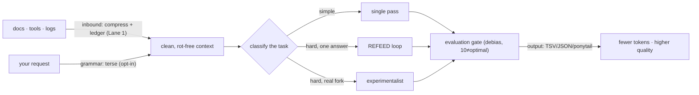

<div align="center">
  
</div>

<p align="center">
  <a href="LICENSE"></a>
  
  
  
</p>

<p align="center"><b>fewer tokens · no context rot · higher-quality answers · no magic claims — the parts that don't work are named</b></p>

<p align="center">
  <a href="#what-is-ordo">What</a> ·
  <a href="#what-ordo-is-trying-to-solve">Why</a> ·
  <a href="#how-to-use-plug-and-play">How to use</a> ·
  <a href="#how-it-works">How it works</a> ·
  <a href="#the-numbers">Numbers</a> ·
  <a href="#inspired-by-shoulders-of-giants">Inspired by</a>
</p>

---

## What is ORDO

ORDO is a **context-engineering framework** you give your LLM. It does three things: **compresses** what
goes in and out (so you pay for fewer tokens), **fights context rot** (so a long chat stays accurate
instead of degrading), and **enforces quality discipline** (so the answer is bug-checked and honest, not
the first plausible draft). It ships as a **paste-in spec** (load it into your system prompt / `CLAUDE.md`)
plus a thin **npm runtime** for the deterministic bits.

It's deliberately not hype. Every claim below is tagged **computed** (a script reproduces it), **agent-judged**
(a blind test produced it), or **grounded** (a cited study). The repo even scores *itself* with its own
evaluation gate and ships the **6.5/10** critique unedited ([`docs/SELF-EVAL.md`](docs/SELF-EVAL.md)).

## What ORDO is trying to solve

Three problems every heavy LLM user hits:

- **Context rot — the silent one.** Performance degrades *non-uniformly as context grows, long before the
  window fills.* Chroma's [Context Rot](https://www.trychroma.com/research/context-rot) report: a 200K
  model degrades meaningfully at **~50K tokens**, even on trivial tasks. [Lost in the Middle](https://arxiv.org/abs/2307.03172):
  the middle of a long context can score **below** sending no context at all. [NoLiMa](https://arxiv.org/abs/2502.05167)
  (ICML 2025): Claude 3.5 dropped **−57.8pp** at 32K once retrieval needed reasoning, not keyword matching.
  Bigger windows don't fix this — *cleaner* context does. **That's why a context limiter makes your LLM smarter.**
- **Token waste.** Pretty-printed JSON, restated context, "Great question!" preambles, re-read files. The
  output and the inbound are mostly recoverable filler.
- **Vibe-coded answers.** The first plausible draft ships a bug, or over-engineers, or quietly bends the
  spec to fit habit. There's no gate forcing "do it good, not fast."

## How to use (plug-and-play)

ORDO is **context-resident** — it works whenever it's *in the model's context*. It is not a daemon; you
**load it once** (and cache it). Three ways, pick your surface:

| Your setup | Do this | It procs… |
|---|---|---|
| **Claude Code (easiest — the `/ordo` endgame)** | `/plugin marketplace add SprucetheAI/ordo` → `/plugin install`, or `npx ordo init` in your project | the **`/ordo` skill auto-loads** on coding/agentic tasks — no pasting, no coding knowledge |
| **Cursor / other IDE agent** | paste [`OPERATING-PROFILE.md`](OPERATING-PROFILE.md) (or [`CONTEXT-SAVER.md`](CONTEXT-SAVER.md)) into your **`CLAUDE.md`** / `.cursorrules` / project rules | every session in that repo, automatically |
| **Chat (Claude.ai / ChatGPT)** | paste it into **Custom Instructions / Project knowledge**, or drop the raw GitHub URL and say "follow this" | every chat in that project |
| **Terminal / your own code** | `npm install ordo-llm` for the runtime; `npx ordo profile` to pipe the spec; **`npx ordo measure`** for the real $/token A/B | wherever you wire it |

**Does it need to be loaded / referenced / uploaded?** Loaded into context — once. On **Claude Code** the
cleanest path is the **plugin** (`/plugin marketplace add SprucetheAI/ordo` → `/plugin install`) or
`npx ordo init`: it drops the `/ordo` skill into `.claude/` and auto-loads on coding tasks, so a non-coder
never pastes anything. Elsewhere, **put it in `CLAUDE.md`** (or project knowledge) and point your LLM/IDE at
`OPERATING-PROFILE.md`. Want the real dollar proof? `npx ordo measure` reads your own session logs and reports
actual tokens + cost — run it with ORDO on vs off for the A/B delta.

### Two lanes (start small)
- **🟢 Lane 1 — Context Saver** ([`CONTEXT-SAVER.md`](CONTEXT-SAVER.md), ~1k tokens): *just* token-saving +
  rot resistance. No language, no gates. This is the "makes your LLM smarter" core. **Start here.**
- **⚫ Lane 2 — Full framework** ([`OPERATING-PROFILE.md`](OPERATING-PROFILE.md), ~1.4k tokens): the lot —
  the compression layers, the quality/autonomy gates, the 10 pillars.
- **🔤 The ORDO language is opt-in, off by default.** The terse command grammar (`σ文3列简` →
  "summarize the following in 3 concise bullets…") is a power-user add-on, not required. Most of the value
  is the output + context discipline, which is plain English. Turn the language on with `ORDO.md`.

```bash
npm install ordo-llm
```
```js
import { decode, emit, compressInbound } from "ordo-llm";
emit({ users: [{ id: 1, name: "A" }, { id: 2, name: "B" }] });  // -> TSV, ~55% fewer tokens than JSON
decode("σ文3列简");                                              // -> the full English instruction (opt-in language)
```

## How it works



The compression is the **grammar + the output contract**, not exotic glyphs (we tested glyphs — they
*lose*). The quality is **structure + gates**: REFEED refeeds a typed critique until the bug is gone;
the experimentalist runs a conventional and an unconventional approach and synthesizes the best of both;
the evaluation gate judges against the real goal, never the prompt, and knows a right-scoped 9 beats a
gold-plated 10. Long runs get an autonomy loop that **kills wrongful loops** and a context-rot gate that
**compacts to a ledger** before the window starves.

## The numbers

<div align="center"></div>

### Built on giants — their claim, then our reality
We stacked the best ideas from the projects below. Each row is **their published claim** (attributed),
then **what ORDO actually measured**. We don't inherit their numbers — we cite them and report our own.

| Project | Their claim | What ORDO takes | Our measured reality |
|---|---|---|---|
| [Headroom](https://github.com/headroomlabs-ai/headroom) | 60–95% fewer context tokens | inbound compaction | **92% on logs/tools** (shape-dependent; lossy+retrieval) |
| Caveman (token-economy) | ~75% via terse register | the output verbosity register | **ponytail 77%, lossless** (operational; never on explainers) |
| [TOON](https://github.com/toon-format/toon) | 30–60% fewer than JSON | format-by-shape | **TSV −59%** on tabular (beats TOON in our bench) |
| [LLMLingua (MSFT)](https://github.com/microsoft/LLMLingua) | up to 20× · +17% RAG | relevance / distractor removal | redundancy proof adopted; relevance-gate on roadmap |
| [GLOSSOPETRAE (elder_plinius)](https://github.com/elder-plinius/GLOSSOPETRAE) | +36pp on hard tasks | the *structure*-composition insight (not the glyphs) | **quality ≥ English, 6-2-1 blind** |
| Lojban | one unambiguous parse | the determinative grammar | **input −32%**, decode 2.00/2 |
| VOKU | mandatory epistemic marking | the epistemic slot | honest null on strong models (no reduction, no backfire) |
| Chroma · Lost-in-the-Middle · RULER · NoLiMa | context rot is real (−20 to −58pp) | the context-rot gate | **grounded**; ledger + compact-at-threshold |
| Ponytail · ADAPT · ultra-analytics (house) | lean · drive-to-done · unbiased rating | tidyness · autonomy loop · the evaluation gate | **−42% first-pass flaws**; self-eval 6.5/10 |

### Our expected reality (the honest blend)
| | reduction | tier |
|---|---|---|
| input command grammar | **~32%** | computed |
| output contract (format + ponytail) | **~55–77%** lossless | computed |
| inbound context | 0–92% (shape-dependent) | computed |
| **end-to-end, realistic turn** | **~47–64%** | computed |
| output quality vs plain English | **6 win / 2 tie / 1 loss** (blind) | agent-judged |
| **NULLS — don't believe otherwise** | single-word swaps ~1% · glyphs *inflate* tokens · **no proven wall-clock speed win** · no hallucination cut on strong models | computed / judged |

All token costs are GPT-`tiktoken` proxies — **re-validate on your model.** Full reproduce commands in
[`BENCHMARKS.md`](BENCHMARKS.md); every claim with its evidence in [`VERDICT.md`](VERDICT.md).

## Inspired by (shoulders of giants)
Headroom · Caveman · Ponytail · TOON · LLMLingua (Microsoft) · GLOSSOPETRAE (elder_plinius) · Lojban ·
VOKU · the context-rot literature (Chroma, Liu et al., NVIDIA RULER, Adobe/LMU NoLiMa) · and the house
ADAPT + ultra-analytics skills. ORDO's contribution is the honest synthesis: *measure everything, keep
what survives, name what doesn't.*

## Brand / style
Xeno-runic, edgy but sanitary: near-black, one acid accent, sharp geometry, the othala rune **ᛟ**
(*order* — literally what "ordo" means) as the mark. Mascot in [`figures/`](figures/).

## Honesty (the moat)
[`DISCLAIMERS.md`](DISCLAIMERS.md) · [`VERDICT.md`](VERDICT.md) · [`docs/SELF-EVAL.md`](docs/SELF-EVAL.md)
(ORDO graded by its own gate: 6.5/10, with the holes) · [`docs/BUILD-LOG.md`](docs/BUILD-LOG.md) ·
[`docs/COMPETITIVE-TEARDOWN.md`](docs/COMPETITIVE-TEARDOWN.md) (12 rival repos torn down through the eval gate) ·
[`docs/ADD-PLAN.md`](docs/ADD-PLAN.md) (the 6 gap-fillers that survived — all shipped). A number counts only
against its evidence tier. Private-use ethics: not for evading safety or monitoring. MIT.
